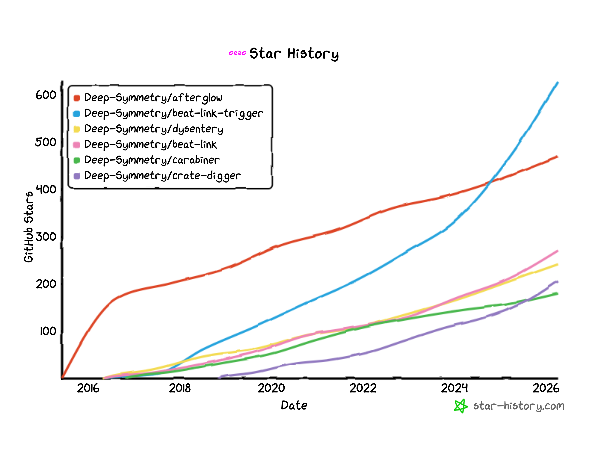

# Deep Symmetry

Our open-source projects are organized here on GitHub. They fall into
a few distinct categories:

* [afterglow](https://github.com/Deep-Symmetry/afterglow) is a
  [Clojure](https://clojure.org) live-coding environment for creating
  and running light shows with DMX and ArtNet fixtures. It led to…

* [dysentery](https://github.com/Deep-Symmetry/dysentery), another
  Clojure project for exploring how to integrate performances with
  Pioneer DJ modular music performance gear. Its primary value is the
  language-independent [protocol analysis
  documentation](https://djl-analysis.deepsymmetry.org/) we published,
  and which has been used by multiple projects to create such
  integrations in a variety of programming languages. Our own
  implementation is:

* [beat-link](https://github.com/Deep-Symmetry/beat-link), for which
  we dropped down from Clojure to Java to make it more accessible to
  by other developers in the JVM ecosystem. Although we find Clojure
  to be much faster and more expressive and safe as a development
  language, not all developers are familiar with it, so slowing down
  to offer this as a pure Java library made it easier for Java,
  Kotlin, and other JVM communities to use. Publishing this library
  led someone to ask us to create:

* [beat-link-trigger](https://github.com/Deep-Symmetry/beat-link-trigger),
  a Clojure integration environment for shows using beat-link.
  Initially a demonstration of how one could send MIDI events in
  response to DJ actions and in sync with beats, it has grown into far
  more, and is our primary focus today, providing an on-ramp to
  performing musicians and their tech crews, who are not primarily
  software developers, to explore what is possible. Using Clojure
  means users can extend the program using the full power of the
  language that was used to create it, without having to fork the
  project or learn how to use a development environment. Code entered
  using the GUI is compiled and loaded with the same power and
  privileges as any other code in the project, and new dependencies
  can be downloaded and activated at runtime.

Over time these main projects spawned sub-projects, split out so that
people who only needed parts of the functionality could use them
separately. See [this page](profile/subprojects.md)
for descriptions of them.

## Star History

Here is one way to see how many people have been discovering the
projects over time. To avoid hammering the GitHub API, this is a
static image, but if you click on it you can see an up-to-date version
(you may need to supply your own GitHub API token if you do it
frequently):

We have not had time to perform shows since 2016, so we aren't using
afterglow any longer, but it was for a long time the repository people
are most excited about. Far more people use Beat Link Trigger, so it
is surprising it took so long to catch up, but as noted above, few of
those users are developers, so they tend not to have GitHub accounts
or know about stars.

Most of the time we previously spent performing has been devoted to
Beat Link Trigger and the related repositories that underpin it, which
many interesting artists are using to synchronize visuals and lighting
with DJ performances.

## Component Projects

As mentioned above, you can learn about the pieces that make up these
main projects and which you might find useful on their own
[here](subprojects.md).
